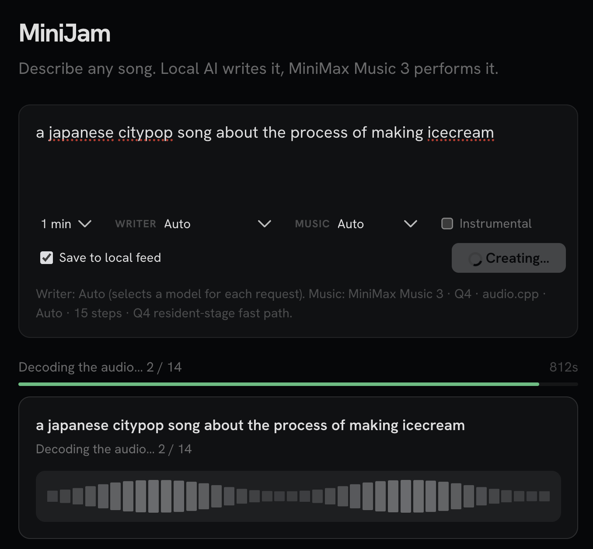

# MiniJam

A localhost port of https://huggingface.co/spaces/victor/MiniMax-Music3-Jam -- designed to run locally, on ALL OS (Mac, Linux, Windows)





Built on MiniMax Music 3. Describe a song in ordinary language; a local Qwen GGUF writer creates its title, tags, lyrics, and MiniMax production caption, then the low-memory music backend renders the track.


## Engines

- Windows and Linux use the native ComfyUI MiniMax implementation with the pruned INT8 text encoder, INT8 DiT, DynamicVRAM, CUDA graphs, prefetch, and automatic tiled decoding.
- Apple Silicon uses audio.cpp with Q4 language and flow models and AB2 sampling. Macs with at least 32 GB unified memory use the faster resident-stage configuration; smaller Macs keep stage-by-stage memory saving enabled. Its arm64 server executable and license are bundled with MiniJam; Install verifies the pinned SHA-256 before enabling it.

The app keeps the useful local workflow—browser player, downloads, MP4 sharing, and a local song feed—without a cover-art model or unrelated diffusion dependencies.

## Requirements

- Windows/Linux: an NVIDIA GPU is recommended. The INT8/DynamicVRAM path targets GPUs down to 8 GB VRAM, but this is a best-effort low-memory configuration and needs ample system RAM. This migration was smoke-tested on a 19 GB GPU; 8 GB hardware was not available locally for validation.
- Apple Silicon: an arm64 Mac with enough unified memory for the Q4 model set.
- At least 32 GB system RAM is recommended; 48 GB gives the low-VRAM offload path more headroom.
- No Hugging Face token is required for the public models.

## Use

1. Click **Install**. The launcher installs the appropriate engine and downloads the MiniMax weights.
2. Click **Start**, then open **MiniJam**.
3. Describe a song, select a duration from 30 seconds through 5 minutes and optional instrumental mode, then click **Generate**.
4. Leave **Music** on **Auto** unless you need a specific tradeoff:
   - **Low VRAM** uses 20 flow steps and tiled decoding on ComfyUI; audio.cpp keeps its 15-step Q4 path.
   - **Quality** uses the Space-compatible 30 steps on ComfyUI and 20 steps on audio.cpp.

The Music dropdown changes generation steps and ComfyUI decoding on each request. On macOS, the separate audio.cpp memory strategy is selected once at startup from installed RAM: fast resident stages at 32 GB or more, stage memory saving below 32 GB.

The local writer closes immediately after composing the song. It defaults to full Metal offload on Apple Silicon and CPU on Windows/Linux so it does not compete with the ComfyUI music model for VRAM. On systems below 40 GB RAM, the music engine is unloaded before the writer runs so both large models are not resident simultaneously.

The browser reports Writer preparation with an elapsed timer, real ComfyUI sampling progress on Windows/Linux, and audio.cpp AR/flow/vocoder progress on macOS. A first-time Metal kernel compilation has no granular events in audio.cpp, so that phase is shown honestly as indeterminate preparation until the first generation event arrives.

Five minutes is the model's supported maximum and is treated as an upper bound: MiniMax may end a complete song earlier. Long songs take substantially longer to render, especially on low-memory hardware, and automatically use tiled decoding on ComfyUI.

## Space behavior retained

The local writer follows the `victor/MiniMax-Music3-Jam` behavior:

- Three-part captions: Global Metadata, Vocal Details, and Arrangement.
- MiniMax-supported section tags, always placed on their own lines.
- Duration-aware lyric structures and instrumental handling.
- Structure seed `N`, texture seed `N + 1`, top-k 50, guidance 1.7, and 30 flow steps in Quality mode.

The ZeroGPU allocation, RTX Pro 6000 AoTI kernels, hosted writer, Gradio Space queue, and GPU cover-art model are intentionally not included because they are not portable to low-VRAM local machines.

## Credits

- [MiniMax Music 3](https://github.com/MiniMax-AI/MiniMax-Music3) provides the music model.
- [ComfyUI](https://github.com/Comfy-Org/ComfyUI) provides the Windows/Linux inference runtime used by MiniJam.
- MiniJam's native audio.cpp path is derived from [fspecii's audio.cpp low-end GPU fork](https://github.com/fspecii/audio.cpp-lowend-gpu), whose low-memory and performance work made MiniMax Music 3 substantially more practical on constrained hardware.
- That fork is based on the original [audio.cpp](https://github.com/0xShug0/audio.cpp) project by 0xShug0 / ShugoAI LLC. Both audio.cpp projects are licensed under Apache 2.0; the license bundled beside MiniJam's native server is in `app/audiocpp-LICENSE.txt`.
- [llama-cpp-python](https://github.com/abetlen/llama-cpp-python) provides the local writer runtime.

## Storage

- `app/comfyui/`: pinned ComfyUI MiniMax runtime on Windows/Linux.
- `app/models/`: Apple Silicon audio.cpp GGUF models.
- `app/composer_models/`: local Qwen writer models downloaded on demand.
- `app/data/songs/`: songs saved to the local feed.
- `cache/`: shared Hugging Face and runtime caches.

When an older installation is upgraded, Install removes its obsolete music-model cache and rebuilds the lightweight app environment once. It does not remove saved songs.

Composer environment overrides:

- `MINIMAX_COMPOSER_PROFILE=tiny|balanced|quality`
- `MINIMAX_COMPOSER_GPU_LAYERS=<number>` (`-1` is the Apple Silicon default for full Metal offload; `0` forces CPU and is the Windows/Linux default)

## API

Base URL: use the URL captured by Pinokio from `start.js`, commonly `http://127.0.0.1:7860`.

The app exposes four named Gradio APIs:

- `/create`
  - Parameters: `description`, `audio_duration`, `seed`, `community`, `composer_profile`, `generation_mode`, `instrumental`
  - `audio_duration` accepts 10 to 300 seconds and is an upper bound; the model may finish earlier.
  - Streams JSON progress messages containing `type`, `stage`, `message`, `progress`, and `elapsed`, followed by the final JSON song.
  - The final song contains `audio`, `title`, `tags`, `lyrics`, `caption`, `bpm`, `language`, `composer_profile`, `composer_model`, `generation_mode`, `seed`, `duration`, `steps`, `tiled_decode`, and optionally `community_url`.
  - `predict()` clients still receive the final song only; use a submitted job or the curl event stream to consume intermediate progress.
- `/generate`
  - Parameters: `prompt`, `lyrics`, `audio_duration`, `steps`, `seed`, `generation_mode`
  - `audio_duration` accepts 10 to 300 seconds and is an upper bound; the model may finish earlier.
  - `prompt` is an explicit MiniMax production caption.
  - Returns a `data:audio/wav;base64,...` string.
- `/community`
  - Returns the newest saved local songs as JSON.
- `/config`
  - Optional parameter: `audio_duration` (defaults to 60 seconds).
  - Returns the active engine label and the exact step/decode settings for every available generation mode at that duration.

### JavaScript

```js
import { Client } from "@gradio/client";

const client = await Client.connect("http://127.0.0.1:7860");
const job = client.submit("/create", {
  description: "Dreamy female synth-pop about leaving home",
  audio_duration: 60,
  seed: -1,
  community: true,
  composer_profile: "auto",
  generation_mode: "auto",
  instrumental: false
});

let song;
for await (const event of job) {
  if (event.type !== "data") continue;
  const value = JSON.parse(event.data[0]);
  if (value.type === "progress") {
    console.log(value.message, value.progress, value.elapsed);
  } else {
    song = value;
  }
}
console.log(song.title, song.generation_mode, song.audio);
```

### Python

```python
import json
from gradio_client import Client

client = Client("http://127.0.0.1:7860")
raw = client.predict(
    description="Cinematic electronic track about starting over",
    audio_duration=60.0,
    seed=-1,
    community=False,
    composer_profile="auto",
    generation_mode="low-vram",
    instrumental=False,
    api_name="/create",
)
song = json.loads(raw)
print(song["title"], song["caption"], song["audio"][:64])
```

### Curl

```bash
EVENT_ID=$(
  curl -X POST http://127.0.0.1:7860/gradio_api/call/create \
    -s -H "Content-Type: application/json" \
    -d '{"data":["A moody trip-hop ballad",60,-1,false,"auto","low-vram",false]}' \
  | python -c 'import sys,json; print(json.load(sys.stdin)["event_id"])'
)

curl -N http://127.0.0.1:7860/gradio_api/call/create/$EVENT_ID
```

Other queue payloads:

- `/generate`: `{"data":["Detailed MiniMax production caption","[verse]\\nCity lights fade",60,30,-1,"auto"]}`
- `/community`: `{"data":[]}`
- `/config`: `{"data":[]}`
